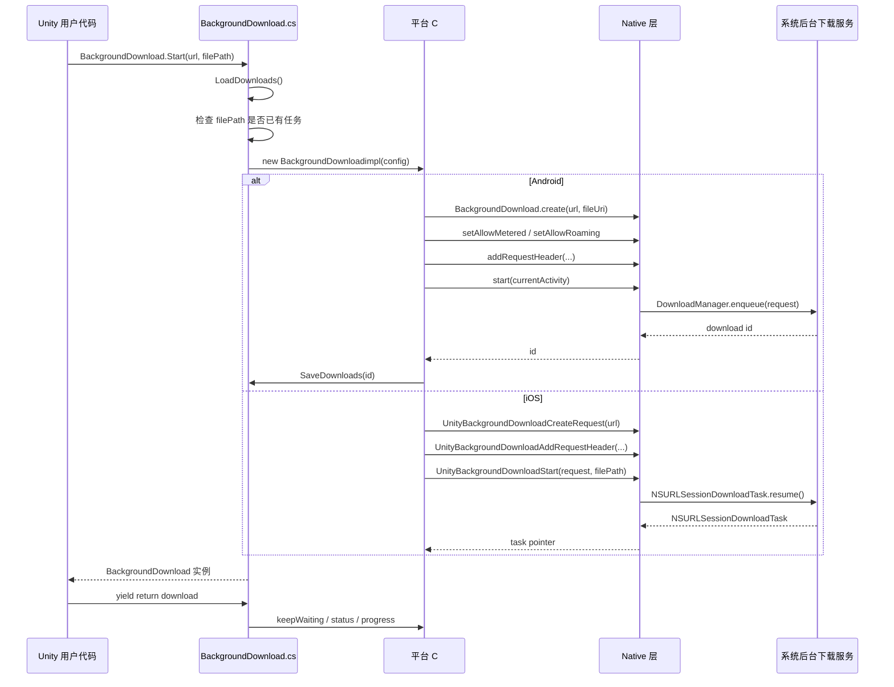
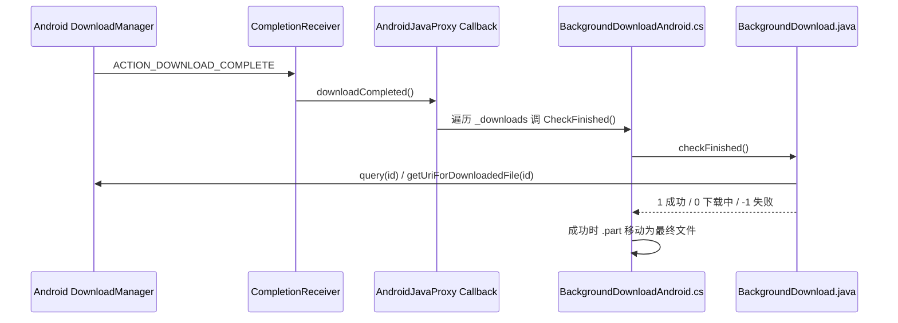
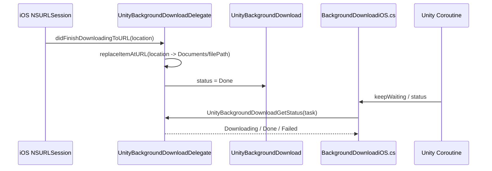

# Background Download 库分析

## 1. 库结构

这是一个 Unity UPM 包，包名为 `com.unity.networking.backgrounddownload`。它提供 Android、iOS、UWP 平台的后台下载能力，Unity Editor 中只保证编译通过，不执行真实下载。

主要目录如下：

```text
BackgroundDownload
├── Runtime
│   ├── BackgroundDownload.cs
│   ├── BackgroundDownloadAndroid.cs
│   ├── BackgroundDownloadiOS.cs
│   ├── BackgroundDownloadUWP.cs
│   ├── BackgroundDownloadEditor.cs
│   ├── Unity.Networking.BackgroundDownload.asmdef
│   └── Plugins
│       ├── Android
│       │   └── backgrounddownload.androidlib
│       │       ├── build.gradle
│       │       └── src/main
│       │           ├── AndroidManifest.xml
│       │           └── java/com/unity3d/backgrounddownload
│       │               ├── BackgroundDownload.java
│       │               └── CompletionReceiver.java
│       └── iOS
│           └── BackgroundDownload.mm
├── Samples
│   └── SingleFile
│       └── SingleFileDownload.cs
├── Tests
│   └── Runtime
│       └── DownloadTests.cs
├── Documentation~
├── README.md
└── package.json
```

核心文件职责：

- `Runtime/BackgroundDownload.cs`：公共 C# API，定义下载配置、状态、启动、恢复、等待和释放逻辑。
- `Runtime/BackgroundDownloadAndroid.cs`：Android C# 桥接层，通过 Unity Android JNI 调用 Java。
- `Runtime/Plugins/Android/.../BackgroundDownload.java`：Android 原生下载封装，底层使用 `DownloadManager`。
- `Runtime/Plugins/Android/.../CompletionReceiver.java`：监听 Android 系统下载完成广播。
- `Runtime/BackgroundDownloadiOS.cs`：iOS C# P/Invoke 桥接层。
- `Runtime/Plugins/iOS/BackgroundDownload.mm`：iOS Objective-C++ 原生实现，底层使用 `NSURLSession` background session。
- `Samples/SingleFile/SingleFileDownload.cs`：单文件下载示例。

## 2. 调用时序图

### 2.1 启动下载



### 2.2 Android 下载完成



### 2.3 iOS 下载完成



## 3. 使用方法

### 3.1 最小下载示例

```csharp
using System;
using System.Collections;
using UnityEngine;
using Unity.Networking;

IEnumerator Download()
{
    using (var download = BackgroundDownload.Start(
        new Uri("https://example.com/file.bin"),
        "files/file.bin"))
    {
        yield return download;

        if (download.status == BackgroundDownloadStatus.Done)
            Debug.Log("下载完成");
        else
            Debug.LogError(download.error);
    }
}
```

### 3.2 恢复上次 App 运行留下的下载

```csharp
IEnumerator Resume()
{
    var downloads = BackgroundDownload.backgroundDownloads;
    if (downloads.Length == 0)
        yield break;

    var download = downloads[0];
    yield return download;

    Debug.Log(download.status);
    download.Dispose();
}
```

### 3.3 带 Header 和网络策略

```csharp
var config = new BackgroundDownloadConfig
{
    url = new Uri("https://example.com/bundle"),
    filePath = "bundles/main.bundle",
    policy = BackgroundDownloadPolicy.UnrestrictedOnly
};

config.AddRequestHeader("Authorization", "Bearer token");

var download = BackgroundDownload.Start(config);
```

使用注意：

- `filePath` 必须是相对路径，最终文件会位于 `Application.persistentDataPath` 下。
- 下载完成后需要调用 `Dispose()`，可以使用 `using` 自动释放。
- 下载未完成时调用 `Dispose()` 会取消下载。
- 不要在下载完成前读取目标文件。
- Editor 下不真正下载，只返回失败状态。
- iOS 不支持 `BackgroundDownloadPolicy`。
- 该库不集成 Addressables 或 AssetBundle，需要业务层自己处理下载后的文件使用。

## 4. 项目特性

- 支持后台下载大文件，适合低优先级、未来使用的资源文件。
- App 进入后台甚至被系统杀掉后，下载任务仍可由系统继续调度。
- 支持 App 下次启动后恢复下载任务。
- 支持 Unity Coroutine：`BackgroundDownload` 继承 `CustomYieldInstruction`，可直接 `yield return download`。
- 支持状态查询：`Downloading`、`Done`、`Failed`。
- 支持进度查询：Android 查询 `DownloadManager`，iOS 查询 `NSURLSessionTask.progress`。
- 支持自定义 HTTP Header。
- Android 和 UWP 支持网络策略；iOS 不支持。
- Android 使用 `.part` 临时文件，成功后再移动到最终路径，降低读取半成品文件的风险。

限制：

- README 明确说明这是非官方支持功能，按 "as is" 方式提供。
- 只支持 Android、iOS、UWP；Editor 只编译。
- 不是通用 HTTP 客户端替代品。
- Android 进度查询需要访问系统 `DownloadManager` 查询结果，频繁调用可能有额外开销。
- Header 和网络策略不保证跨 App 重启持久化。

## 5. Native 核心代码原理

### 5.1 C# 公共 API 层

`BackgroundDownload.cs` 用编译宏将公共 API 绑定到具体平台实现：

```csharp
#if UNITY_EDITOR
using BackgroundDownloadimpl = Unity.Networking.BackgroundDownloadEditor;
#elif UNITY_ANDROID
using BackgroundDownloadimpl = Unity.Networking.BackgroundDownloadAndroid;
#elif UNITY_IOS
using BackgroundDownloadimpl = Unity.Networking.BackgroundDownloadiOS;
#elif UNITY_WSA_10_0
using BackgroundDownloadimpl = Unity.Networking.BackgroundDownloadUWP;
#endif
```

`BackgroundDownload.Start(config)` 的核心流程：

1. 调用 `LoadDownloads()` 懒加载已有任务。
2. 用 `config.filePath` 检查是否已存在同目标文件的下载。
3. 创建平台实现对象：`new BackgroundDownloadimpl(config)`。
4. 加入静态字典 `_downloads`。
5. 调用平台实现的 `SaveDownloads()`。

公共类继承 `CustomYieldInstruction`，所以业务代码可以直接：

```csharp
yield return download;
```

只要平台实现的 `keepWaiting` 返回 `true`，Coroutine 就会继续等待。

### 5.2 Android C# 桥接层

`BackgroundDownloadAndroid.cs` 通过 Unity Android JNI 调 Java：

```csharp
_backgroundDownloadClass =
    new AndroidJavaClass("com.unity3d.backgrounddownload.BackgroundDownload");
```

启动时主要做这些事：

1. 将目标相对路径拼到 `Application.persistentDataPath`。
2. 构造临时下载路径：`最终路径 + ".part"`。
3. 删除旧最终文件和旧临时文件。
4. 创建 Java `BackgroundDownload` 对象。
5. 设置移动网络、漫游策略和 HTTP Header。
6. 从 `UnityPlayer.currentActivity` 拿到 Android `Activity`。
7. 调 Java `start(activity)`，返回 Android 系统下载 id。

关键点是 `.part` 文件：

```csharp
_tempFilePath = filePath + TEMP_FILE_SUFFIX;
string fileUri = "file://" + _tempFilePath;
```

Android `DownloadManager` 直接写入 `.part`。完成后，C# 层在 `CheckFinished()` 中把 `.part` 移动到最终文件：

```csharp
File.Move(_tempFilePath, filePath);
```

这样业务层看到的最终文件更接近“完成后才出现”。

### 5.3 Android Java 原生层

Android 原生下载使用系统 `DownloadManager`：

```java
manager = (DownloadManager)context.getSystemService(Context.DOWNLOAD_SERVICE);
id = manager.enqueue(request);
```

这里的 `enqueue(request)` 是整个 Android 后台下载能力的关键。调用后，下载任务交给 Android 系统下载管理器，而不是由 Unity App 自己的线程持续下载。

创建请求时：

```java
request = new DownloadManager.Request(url);
request.setDestinationUri(dest);
request.setNotificationVisibility(DownloadManager.Request.VISIBILITY_HIDDEN);
```

状态查询时：

```java
DownloadManager.Query query = new DownloadManager.Query();
query.setFilterById(id);
Cursor cursor = manager.query(query);
```

查询逻辑：

- `getUriForDownloadedFile(id)` 非空：认为下载成功。
- `STATUS_FAILED`：下载失败，转换 `COLUMN_REASON` 为错误文本。
- `STATUS_SUCCESSFUL`：下载成功。
- 其他状态：仍在下载。

完成通知通过 `CompletionReceiver`：

```java
if (DownloadManager.ACTION_DOWNLOAD_COMPLETE.equals(intent.getAction())) {
    callback.downloadCompleted();
}
```

如果 Unity 进程还活着，receiver 会回调 C# 的 `AndroidJavaProxy`。如果 Unity C# 侧已经销毁，代码捕获 `UnsatisfiedLinkError` 并清空 callback。即使这次回调丢失，下次 App 启动仍可以通过保存的下载 id 查询系统状态。

### 5.4 Android 恢复机制

Android 的恢复依赖 `DownloadManager` 返回的 long id。

Unity C# 层将 id 写入：

```text
Application.persistentDataPath/unity_background_downloads.dl
```

下次 App 启动时，`LoadDownloads()` 读取这些 id，再调用 Java：

```java
BackgroundDownload.recreate(context, id)
```

Java 侧通过 `DownloadManager.Query` 查系统中是否还有这个任务：

```java
query.setFilterById(id);
Cursor cursor = manager.query(query);
```

如果查得到，就读取系统记录中的下载 URL 和本地目标 URI，重新构造 Java `BackgroundDownload` 对象。C# 再从 Java 对象中读回 URL 和目标路径，重建 Unity 侧的 `BackgroundDownloadAndroid`。

### 5.5 iOS C# 桥接层

`BackgroundDownloadiOS.cs` 通过 P/Invoke 调 Objective-C++：

```csharp
[DllImport("__Internal")]
static extern IntPtr UnityBackgroundDownloadCreateRequest(
    [MarshalAs(UnmanagedType.LPWStr)] string url);
```

启动时：

1. 创建目标目录。
2. 调 `UnityBackgroundDownloadCreateRequest(config.url.AbsoluteUri)` 创建 native request。
3. 调 `UnityBackgroundDownloadAddRequestHeader(...)` 添加 Header。
4. 调 `UnityBackgroundDownloadStart(request, config.filePath)` 启动 native 下载。
5. 保存 native 返回的 `IntPtr _backend`，它实际指向 `NSURLSessionDownloadTask`。

状态和进度通过 native 函数查询：

```csharp
_status = (BackgroundDownloadStatus)UnityBackgroundDownloadGetStatus(_backend);
return UnityBackgroundDownloadGetProgress(_backend);
```

### 5.6 iOS Objective-C++ 原生层

iOS 的后台下载依赖 `NSURLSession` background session：

```objc
NSURLSessionConfiguration* config =
    [NSURLSessionConfiguration backgroundSessionConfigurationWithIdentifier:
        kUnityBackgroungDownloadSessionID];
```

这个 background session 是 iOS 后台下载能力的核心。下载任务由系统调度，不是由 Unity 进程中的普通线程持续执行。

启动下载：

```objc
NSURLSessionDownloadTask *task =
    [session downloadTaskWithRequest: request];
task.taskDescription = dest;
[task resume];
```

这里用 `taskDescription` 保存目标相对路径。下载完成后，系统回调：

```objc
- (void)URLSession:(NSURLSession *)session
      downloadTask:(NSURLSessionDownloadTask *)downloadTask
didFinishDownloadingToURL:(NSURL *)location
```

回调中把系统临时文件替换到目标路径：

```objc
[fileManager replaceItemAtURL: destUri
                 withItemAtURL: location
                backupItemName: nil
                       options: NSFileManagerItemReplacementUsingNewMetadataOnly
              resultingItemURL: nil
                         error: nil];
```

如果任务完成但有错误，则在：

```objc
- (void)URLSession:(NSURLSession *)session
              task:(NSURLSessionTask *)task
didCompleteWithError:(NSError *)error
```

中把状态设为失败，并保存 `error.localizedDescription`。

### 5.7 iOS 恢复机制

iOS 不像 Android 那样自己保存下载 id 文件，而是依赖相同的 background session identifier。

插件初始化时创建同一个 session：

```objc
kUnityBackgroungDownloadSessionID = @"UnityBackgroundDownload";
```

然后调用：

```objc
[session getTasksWithCompletionHandler:...]
```

拿到系统中仍属于该 background session 的 download tasks，并放入 `backgroundDownloads` 字典。

C# 侧调用：

```csharp
UnityBackgroundDownloadGetCount();
UnityBackgroundDownloadGetAll(loadedDownloads);
UnityBackgroundDownloadGetUrl(backend, buffer);
UnityBackgroundDownloadGetFilePath(backend, buffer);
```

再把 native task 包装成新的 `BackgroundDownloadiOS` 对象。

## 6. 为什么 App 被杀后下载还能继续

这里容易产生误解：如果下载是 App 自己创建的普通线程，那么 App 进程被杀后，线程一定会一起结束，下载不可能继续。

这个库能支持“App 进入后台甚至被系统杀掉后继续下载”，原因是它没有在 App 自己的线程里执行下载，而是把下载任务提交给操作系统的后台下载服务。

### 6.1 普通线程下载模型

```text
Unity App 进程
└── App 自己创建的下载线程
    └── 执行 HTTP 下载

App 进程被杀
└── 下载线程一起死亡
```

这种模型确实不能在进程死亡后继续下载。

### 6.2 本库的后台下载模型

```text
Unity App 进程
└── 创建下载请求
    └── 提交给 OS 后台下载服务

OS 后台下载服务
└── 持有并调度下载任务

Unity App 进程被杀
└── App 内存和线程消失

OS 后台下载服务
└── 任务仍可继续或在合适条件下继续

Unity App 下次启动
└── 通过任务 id / session identifier 找回任务状态
```

所以所谓“后台下载”不是“Unity 线程在后台不死”，而是“下载任务被转交给系统级服务”。

### 6.3 Android 上为什么可行

Android 使用的是系统 `DownloadManager`。

当 Java 调用：

```java
manager.enqueue(request);
```

后，下载任务进入 Android 系统下载管理器。这个任务不再依赖 Unity 进程里的下载线程。

Unity 进程死亡后：

- Unity 的 C# 对象会消失。
- Unity 的 Java callback 也可能失效。
- 但 Android 系统下载管理器中的任务仍然存在。

下次 App 启动时：

- C# 读取之前保存的 download id。
- Java 用 `DownloadManager.Query` 查询该 id。
- 如果系统中仍有任务，就恢复 URL、目标路径、状态和进度。

### 6.4 iOS 上为什么可行

iOS 使用的是 `NSURLSessionConfiguration backgroundSessionConfigurationWithIdentifier`。

这种 background session 的下载任务由 iOS 系统接管。App 进入后台或被系统终止后，系统仍可以根据网络、电量、资源调度等条件继续执行任务。

App 再次启动时，只要使用同一个 session identifier：

```objc
@"UnityBackgroundDownload"
```

就可以通过 `getTasksWithCompletionHandler` 找回属于这个 background session 的任务。

iOS 还提供：

```objc
URLSessionDidFinishEventsForBackgroundURLSession
```

用于处理后台 session 事件完成后的系统回调。本库通过 `AppDelegateListener` 接入 Unity App 生命周期。

### 6.5 结论

这个库的关键设计是：

```text
Unity/C# API 负责：
- 创建任务
- 保存任务标识
- 查询任务状态
- 暴露 Coroutine 等待接口
- 处理完成文件和释放

操作系统负责：
- 真正执行后台下载
- 在 App 后台或 App 进程结束后继续持有任务
- 在任务完成或失败后保存系统状态
```

因此，“App 被杀后仍可继续下载”并不违背进程和线程模型。App 自己的线程确实不能存活，但下载已经不在 App 线程里运行，而是在 Android `DownloadManager` 或 iOS `NSURLSession` background session 对应的系统机制中运行。

## 7. 代码质量、安全性与鲁棒性分析

### 7.1 总体评价

这个库的核心架构是合理的：C# 层提供统一 API，Android 和 iOS 原生层把任务交给系统后台下载服务。它没有自己维护下载线程，而是复用 Android `DownloadManager` 和 iOS `NSURLSession` background session，这是正确方向。

不过从代码质量看，它更像一个预览版或实验性包。整体实现偏薄，成功路径清晰，但输入校验、异常路径、平台新版本兼容、生命周期边界和错误表达都比较粗糙。如果用于生产环境，需要补一轮鲁棒性和安全性改造。

### 7.2 filePath 缺少严格校验

问题：

公共 API 要求 `filePath` 是相对路径，最终文件保存在 `Application.persistentDataPath` 下。但当前代码主要依赖文档说明，没有在 `BackgroundDownload.Start(config)` 或平台实现中强制校验。

可能的非法输入：

```text
../outside/file.bin
/absolute/path/file.bin
C:\absolute\path\file.bin
空字符串
null
```

风险：

- 可能写出 `Application.persistentDataPath` 范围。
- iOS 或 Android 路径解析可能异常。
- 同一个文件可能因为路径表现不同绕过 `_downloads.ContainsKey(config.filePath)`。
- 存在路径穿越风险。

优化方案：

- 在公共 C# 层统一校验，而不是各平台分散处理。
- 拒绝 `null`、空字符串、绝对路径、包含 `..` 的路径。
- 将路径标准化后作为 `_downloads` 的 key。
- 计算最终绝对路径后，确认它仍然位于 `Application.persistentDataPath` 下。

原理：

路径属于安全边界，应该在平台无关入口统一收口，避免非法路径进入 Native 层。

### 7.3 URL 缺少校验

问题：

`config.url` 没有检查 `null`、scheme 或 URL 合法性。

风险：

- `config.url == null` 会导致运行时空引用。
- `file://`、`content://` 或其他非预期 scheme 可能被传入系统下载服务。
- 如果下载内容后续会被加载执行或解析，明文 HTTP 存在被篡改风险。

优化方案：

- C# 层检查 `url != null`。
- 默认只允许 `http` 和 `https`。
- 生产资源建议优先要求 `https`。
- 如果确实需要 HTTP，可以提供显式开关，而不是默认放行所有 URI。

原理：

下载入口应该明确协议边界，避免把任意 URI 交给系统服务。

### 7.4 Android Coroutine 等待可能卡住

问题：

Android 侧 `keepWaiting` 只判断 `_status`：

```csharp
public override bool keepWaiting { get { return _status == BackgroundDownloadStatus.Downloading; } }
```

它没有主动调用 `CheckFinished()`。状态主要依赖 `CompletionReceiver` 收到系统广播后回调 C#。

风险：

- 如果广播丢失、receiver 没触发、callback 失效，Coroutine 可能一直等待。
- 进度查询也不会顺便刷新完成状态。
- iOS 的 `keepWaiting` 每次会主动 `UpdateStatus()`，Android 和 iOS 行为不一致。

优化方案：

可以在 `keepWaiting` 中主动刷新状态：

```csharp
public override bool keepWaiting
{
    get
    {
        CheckFinished();
        return _status == BackgroundDownloadStatus.Downloading;
    }
}
```

如果担心每帧查询 `DownloadManager` 成本过高，可以做低频轮询，例如每 0.5 秒或 1 秒查询一次。

原理：

完成通知可以作为优化路径，但不能作为唯一状态更新路径。可靠状态应以系统查询结果为准。

### 7.5 Android Dispose 顺序有状态不一致风险

问题：

Android 实现中：

```csharp
public override void Dispose()
{
    RemoveDownload();
    base.Dispose();
}
```

`RemoveDownload()` 会调用 Java 的 `remove()`，移除系统下载记录。但 Android C# 层的 `.part -> final` 文件移动逻辑在 `CheckFinished()` 中。

风险：

- 如果任务已经完成，但 C# 还没执行 `CheckFinished()`，可能先移除系统记录。
- 系统记录移除后，最终文件移动状态不够明确。
- 完成任务和未完成任务使用同一套释放路径，语义不清晰。

优化方案：

- `Dispose()` 开始时先调用 `CheckFinished()`。
- 如果已完成，先确保 `.part` 已移动到最终文件，再移除系统记录。
- 如果仍在下载中，再取消系统任务。
- 更理想的是拆分 `Cancel()` 和 `Dispose()` 语义。

原理：

释放资源前应先同步最终状态，避免“系统记录没了，但本地文件还没落定”。

### 7.6 Android Cursor 没有完整关闭

问题：

Java 层多处使用 `DownloadManager.Query` 获取 `Cursor`，部分提前返回路径没有 `close()`。

例如恢复任务时：

```java
Cursor cursor = manager.query(query);
if (cursor.getCount() == 0)
    return null;
```

风险：

- Cursor 泄漏系统资源。
- 多次查询进度或恢复任务时可能积累资源。
- 异常路径没有 `finally` 保护。

优化方案：

- 使用 `try/finally` 保证 `cursor.close()`。
- 如果 Java 语法环境允许，可以使用 try-with-resources。
- 所有 `manager.query(query)` 都必须覆盖空结果、异常、提前返回路径。

原理：

Cursor 持有系统数据库资源，不能依赖 GC 及时释放。

### 7.7 Android Manifest 兼容新系统有问题

问题：

`CompletionReceiver` 带 `intent-filter`，但 manifest 中没有声明 `android:exported`。Android 12 开始，带 intent-filter 的组件必须显式声明 `android:exported`。

另外：

```xml
<uses-permission android:name="android.permission.WRITE_EXTERNAL_STORAGE" />
<uses-permission android:name="android.permission.DOWNLOAD_WITHOUT_NOTIFICATION" />
```

这些权限在新 Android 版本下语义变化较大。`WRITE_EXTERNAL_STORAGE` 已经过时，`DOWNLOAD_WITHOUT_NOTIFICATION` 也不适合作为普通应用稳定依赖的能力。

风险：

- 新 targetSdk 下构建或安装失败。
- 存储权限行为和旧版本不同。
- 隐藏下载通知的行为可能受系统和权限限制。

优化方案：

- 给 receiver 添加明确的 `android:exported`。
- 根据目标 Android SDK 更新权限策略。
- 如果目标路径在 App 私有目录，尽量避免申请外部存储权限。
- 针对 Android 10+ scoped storage 重新验证文件写入策略。

原理：

Android 后台下载、广播组件和存储权限在新系统中变化很大，旧 manifest 不能直接视为生产可用。

### 7.8 Android 使用 file:// 字符串拼接较脆弱

问题：

Android C# 层直接拼接目标 URI：

```csharp
string fileUri = "file://" + _tempFilePath;
```

风险：

- 路径中如果有空格或特殊字符，没有 URI encode。
- 不同 Android 版本对 file URI 和目标路径限制不同。
- `Application.persistentDataPath` 的实际路径在不同设备上可能差异较大。

优化方案：

- 把文件路径字符串传给 Java，由 Java 使用 `Uri.fromFile(new File(path))` 构造 URI。
- 或者 C# 使用可靠的 URI 构造方式，而不是手写字符串拼接。
- 启动下载前明确验证目标目录存在且可写。

原理：

URI 不应通过字符串拼接构造，路径字符集、转义规则和平台行为都容易出错。

### 7.9 iOS 恢复任务存在异步竞态

问题：

iOS Native 层通过：

```objc
[session getTasksWithCompletionHandler:^(...) {
    ...
}];
```

收集已有 background session 任务。这个 API 是异步的，但 C# 侧可能在它完成前调用 `UnityBackgroundDownloadGetCount()`。

风险：

- App 启动后立刻访问 `BackgroundDownload.backgroundDownloads`，可能返回 0。
- 已存在的后台任务可能没有被 Unity 层恢复。
- 问题依赖启动时序，难以稳定复现。

优化方案：

- Native 层提供“任务收集完成”的初始化状态或回调。
- `GetCount/GetAll` 时同步等待 `getTasksWithCompletionHandler` 的结果。
- C# 层延迟首次恢复，直到 native session 完成任务收集。

原理：

恢复任务是跨进程状态同步，API 设计必须尊重系统异步接口，不能假设 native 初始化瞬间完成。

### 7.10 iOS Native 字典线程安全不足

问题：

`UnityBackgroundDownloadDelegate` 中的 `backgroundDownloads` 是 `NSMutableDictionary`。NSURLSession delegate 回调可能在 delegate queue 上执行，而 C# P/Invoke 查询可能来自 Unity 主线程。

风险：

- C# 查询状态时，delegate 正在修改字典。
- 偶发崩溃。
- 状态读写不一致。

优化方案：

- 指定 serial delegate queue。
- 所有 `backgroundDownloads` 访问都通过同一个 dispatch queue。
- 或使用 `@synchronized` 包裹字典读写。

原理：

Native 状态表属于共享可变状态，必须统一线程模型。

### 7.11 iOS 文件替换忽略错误

问题：

iOS 下载完成后执行文件替换：

```objc
[fileManager replaceItemAtURL: destUri
                 withItemAtURL: location
                backupItemName: nil
                       options: NSFileManagerItemReplacementUsingNewMetadataOnly
              resultingItemURL: nil
                         error: nil];
download.status = kStatusDone;
```

即使文件替换失败，也会把状态设为 Done。

风险：

- 网络下载成功，但最终文件不存在。
- 上层看到 Done 后读取文件失败。
- 文件系统错误信息被丢弃。

优化方案：

- 传入 `NSError*`。
- 如果 replace 失败，设置 `status = Failed`。
- 保存错误描述供 C# 层读取。
- Done 应代表“目标文件已经可用”，而不只是“网络下载完成”。

原理：

该库的 API 语义是“下载文件到目标路径”。因此落盘失败也应视为下载失败。

### 7.12 iOS 固定 2048 字节字符串缓冲区不鲁棒

问题：

iOS C# 和 Native 之间传 URL、filePath、error 时使用固定 2048 字节 buffer。

风险：

- 长 URL、长路径、长错误信息被截断。
- UTF-16 字符串截断可能导致解析异常。
- C# `new Uri(...)` 可能因截断后的字符串非法而失败。

优化方案：

- Native 提供长度查询函数，再由 C# 分配足够 buffer。
- 或 Native 返回分配好的字符串指针，并提供释放函数。
- 至少检测截断并返回明确错误。

原理：

跨语言字符串传递不应依赖固定小 buffer，尤其 URL 和错误信息长度不可控。

### 7.13 错误信息和状态模型过于简单

问题：

当前状态只有：

```text
Downloading
Done
Failed
```

失败原因主要依赖字符串。

风险：

- 无法区分取消、网络等待、系统暂停、权限失败、磁盘不足、HTTP 错误、URL 非法。
- 上层只能解析字符串，不利于业务恢复策略。
- Android `reasonToError` 覆盖不完整，且有 `"Unkown error"` 拼写错误。

优化方案：

- 保留现有枚举以兼容 API。
- 增加结构化错误码，例如 `BackgroundDownloadErrorCode`。
- Android 映射 `DownloadManager` reason。
- iOS 映射 `NSError.domain` 和 `NSError.code`。
- 取消任务应和失败区分。

原理：

失败原因是业务决策输入，例如是否重试、是否提示用户清空间、是否切换网络。它不应该只依赖非结构化字符串。

### 7.14 API 设计职责偏重

问题：

`BackgroundDownload` 同时承担多种职责：

- 下载句柄。
- Coroutine yield instruction。
- Dispose 取消逻辑。
- 静态任务注册表。
- 平台恢复入口。

风险：

- 生命周期语义不够清晰。
- `Dispose()` 到底是“释放句柄”还是“取消下载”容易混淆。
- 后续扩展暂停、重试、错误码、事件通知时会越来越重。

优化方案：

- 保持现有 API 兼容。
- 内部拆分职责：
  - `BackgroundDownloadHandle`：用户持有对象。
  - `IBackgroundDownloadBackend`：平台后端接口。
  - `BackgroundDownloadRegistry`：任务缓存和恢复。
- 新增显式 `Cancel()`，让取消语义和释放语义更清楚。

原理：

公共对象越薄，生命周期越容易管理。取消任务和释放引用最好不要混在一个隐式行为里。

### 7.15 测试覆盖不足

问题：

当前测试主要覆盖成功下载文件和下载到子目录。

缺少场景：

- 非法 `filePath`。
- 重复 `filePath`。
- Header。
- 取消下载。
- 恢复下载。
- 下载失败。
- 目标目录不存在。
- iOS 文件移动失败。
- Android receiver 失效后的轮询恢复。
- 超长 URL/path。
- Android/iOS 新系统版本兼容。

优化方案：

- C# 层先加平台无关单元测试，覆盖参数校验和 registry 逻辑。
- Android 用可控测试 URL 模拟 404、断网、大文件、慢速下载。
- iOS 验证 background session 恢复时序。
- 对 Native 层做手动或自动集成测试矩阵。

原理：

后台下载的 bug 多数发生在生命周期和异常路径，只测成功路径不足以支撑生产稳定性。

## 8. 优化优先级建议

### 8.1 最高优先级

1. C# 层补 `url` 和 `filePath` 参数校验。
2. Android `keepWaiting` 主动刷新状态，避免 Coroutine 卡死。
3. Android Cursor 全部保证关闭。
4. iOS 文件替换失败不能返回 Done。
5. Android Manifest 适配新 targetSdk，尤其是 `android:exported`。

这些问题要么涉及安全边界，要么会导致任务卡死、资源泄漏、错误状态或新系统不可用，应该优先处理。

### 8.2 第二优先级

1. iOS 恢复任务异步竞态处理。
2. iOS Native 字典线程安全。
3. Android file URI 构造方式优化。
4. 错误码结构化。
5. `Dispose()` 和 `Cancel()` 语义拆清楚。

这些问题更多影响复杂生命周期、可维护性和上层业务体验，适合在第一轮安全和稳定性修复后继续推进。

### 8.3 总结

这个库的架构方向是对的，但实现偏“最小可用”。如果要用于生产，重点不在于重写下载逻辑，而在于补齐以下能力：

- 输入校验。
- 生命周期边界处理。
- 系统版本兼容。
- Native 资源管理。
- 错误处理。
- 状态恢复一致性。
- 测试覆盖。

核心原则是：继续依赖系统后台下载能力，但把 Unity API 层和 Native 桥接层做得更可验证、更安全、更能承受异常路径。
